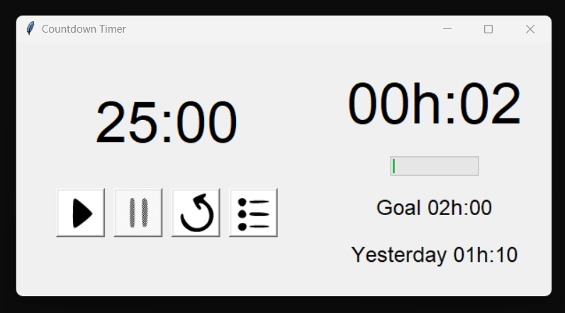

## Description

A Python application that uses Tkinter to display a countdown timer, helping you manage your time and productivity. The application keeps track of the time you have accumulated on the current day and the last days you have worked. It also includes a daily goal that can be set by the user. The daily worked hours are all saved in a .csv file. In the future I will add some plots to check your worked hours in a cool way!

## Features

- Countdown timer with configurable time period
- Displays time accumulated today and on the last day worked
- Shows progress toward the daily goal
- Settings to configure countdown and daily goal times
- CSV and JSON storage for timer history and settings

## Dependencies

- Python 3.x
- Tkinter
- Pandas
- winsound
- datetime
- json
- re

To install all the required packages, run the following command:

```bash
pip install pandas
```

> Note: Tkinter comes pre-installed with Python, and the other dependencies are part of Python's standard library. Using pandas is an overkill, maybe in the future I can change it.

## Installation and Setup

1. Clone the repository:
    ```bash
    git clone https://github.com/YOUR_GITHUB_USERNAME/CountdownTimer.git
    ```

2. Navigate into the project directory:
    ```bash
    cd CountdownTimer
    ```

3. Make sure you have Python installed and run:
    ```bash
    python main.py
    ```

## Usage

1. **Start Button**: To start the timer.
2. **Pause Button**: To pause the timer. The application will also update the accumulated time and progress bar.
3. **Reset Button**: To reset the timer to its initial state.
4. **Settings Button**: To open settings where you can set the daily goal and countdown time.

### Settings

You can configure the daily goal and countdown time period in the settings window.

- **Daily Goal**: Set your daily goal in `HH:MM` format.
- **Countdown Time**: Set the countdown time in `MM:SS` format.

> Note: The max values allowed for each entry are 0-99:0-59.

## Configuration

The application uses a `config.json` file to save the countdown and daily goal times. Additionally, a `records.csv` file stores the record of the time accumulated.

## Contributing

Feel free to fork the project and submit a pull request with your changes!

## License

This project is licensed under the MIT License - see the [LICENSE.md](LICENSE.md) file for details.

---

Built with ❤️ by [Joaquín Amigó Vega](https://github.com/jamigov)